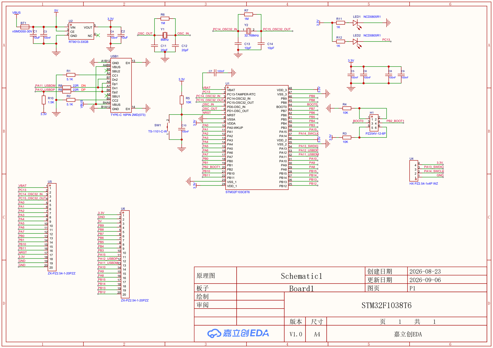
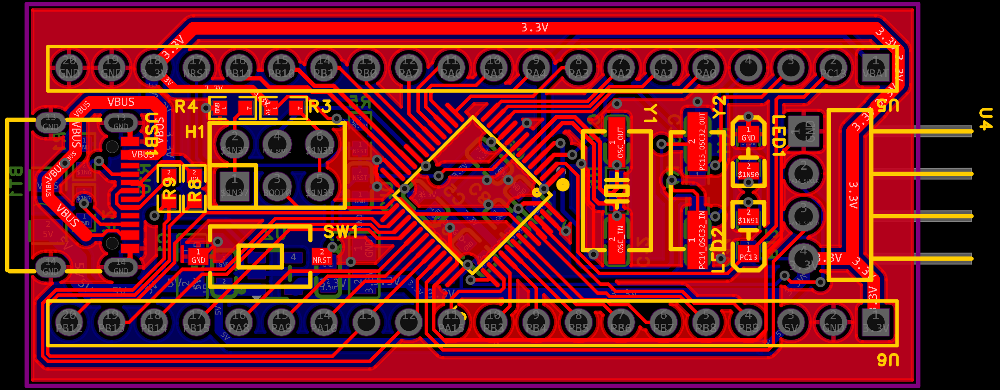
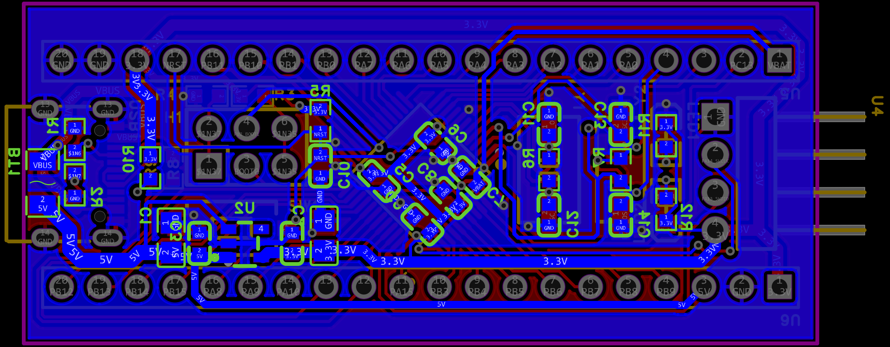

# 硬件第一题：STM32F103C8T6 最小系统板

使用嘉立创 EDA 专业版绘制，图纸导出日期为 2026-09-06。

## 图纸文件

| 文件 | 内容 |
|---|---|
| [schematic.pdf](schematic.pdf) | 原理图，1 页，嘉立创原始导出 PDF |
| [schematic.png](schematic.png) | 从原理图 PDF 渲染的高清预览 |
| [pcb.pdf](pcb.pdf) | PCB 原始导出 PDF，共 6 页：顶面装配、底面装配、BOM、顶面走线、底面走线、钻孔图 |
| [pcb-top.png](pcb-top.png) | 顶层突出显示的彩色 PCB 视图，包含其他可见层 |
| [pcb-bottom.png](pcb-bottom.png) | 底层突出显示的彩色 PCB 视图，包含其他可见层 |

## 设计内容

主控为 STM32F103C8T6，包含 8 MHz 晶振、32.768 kHz 晶振、5V 转 3.3V 稳压电路、复位按键、启动配置跳线、SWD 接口、电源指示灯、PC13 功能指示灯、Type-C 接口和 IO 排针。

本次提交为原理图及 PCB 图纸材料；不包含实物制作或运行验证记录，也不以 DRC 通过代替实测结果。PDF 与用户提供的 PCB PNG 保持原始内容，原理图 PNG 仅作格式转换。原生 EDA 工程未包含在本次图纸上传中。

## 预览

### 原理图

### PCB 顶层突出显示

### PCB 底层突出显示

