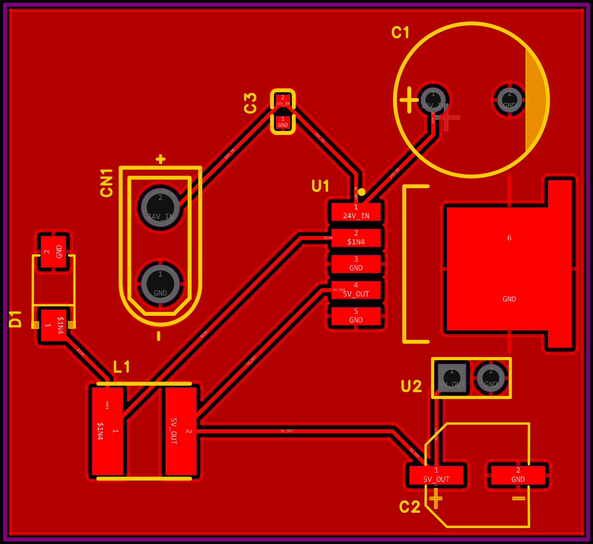
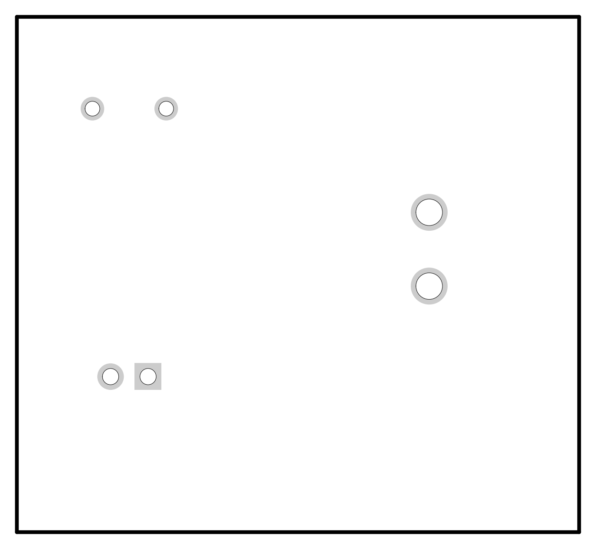

# 硬件第二题：24V 转 5V 降压模块

[设计说明与三方案对比](design.md)

| 材料 | 文件 |
|---|---|
| 原理图 PDF | [schematic.pdf](schematic.pdf) |
| 原理图 PNG | [schematic.png](schematic.png) |
| PCB PDF（6页，原始导出） | [pcb.pdf](pcb.pdf) |
| PCB 顶面 PNG（用户原始导出） | [pcb-top.png](pcb-top.png) |
| PCB 底面 PNG（由上述PDF第5页渲染） | [pcb-bottom.png](pcb-bottom.png) |

已完成原理图和PCB绘制；目标24V转5V/1A，未仿真、制板及实测。底面预览忠实保留PDF内容，仅见板框与通孔；不代表另行生成了底层布线。原生EDA工程未包含在本次图纸上传中。

